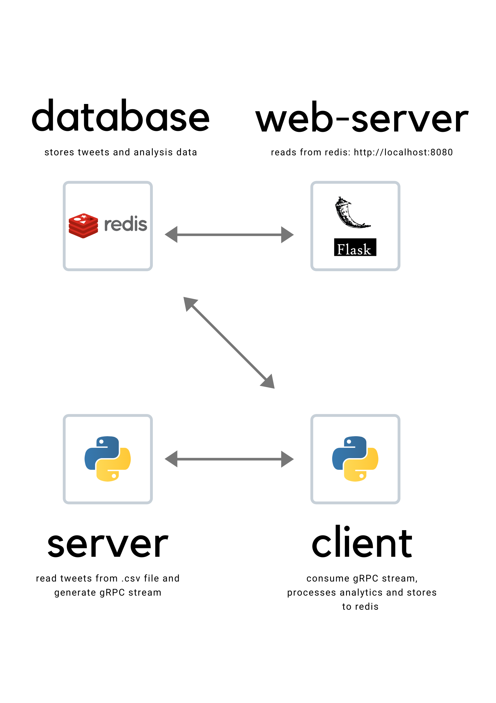
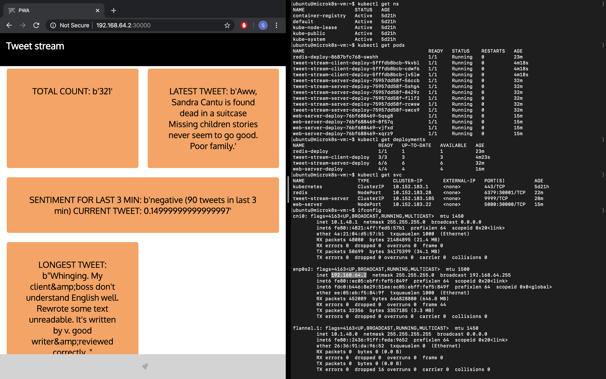

# srodi-gRPC streaming
gRPC example to implement data streaming and simulate real-time analytics

#### Prerequisites
* Python version 2.7 or higher
* Docker version 19.03 or higher
* Add `.csv` file with relative path `server/static/training.1600000.processed.noemoticon.csv`

File `training.1600000.processed.noemoticon.csv` can be downloaded from this [link](https://www.kaggle.com/kazanova/sentiment140/data)

#### Architecture
Docker compose will bring up 4 containers following the architecture described in diagram below.

I have chosen to implement a server to read the tweets csv and generate the gRPC 
stream which is then consumed by a client service which live-streams the tweets, 
processes some analytics and stores tweets/analytics-results in a redis service. 
To complete the project I have developed a frontend service with python Flask 
which reads from redis and displays tweets (http://localhost:8080). The server is 
streaming tweets with a 2 seconds delay between each tweet, so if you refresh the frontend 
you can see new tweets coming in. This architecture allows for separation of concerns 
where each service is in charge of a limited number of specific tasks. This architecture 
promotes low coupling and high cohesion where the only dependency is client-depend-on-server 
for the gRPC stream. 



# Docker - Compose
This steps allow to create and run the containerized micro-services.
Following commands must be executed within `srodi-gRPC/test/` directory.

#### Build and run containers:
```bash
docker-compose up
```

#### Clean up
Stop execution and remove containers:
```bash
docker-compose stop
docker-compose rm
```
You will also have to remove docker images by running `docker images` and `docker rmi [IMAGE_ID]`

# Run locally (without Docker)
This refers to server and gRPC-stream client only

#### Clone repo and prepare environment
Initial steps
```bash
git clone https://github.com/srodi/srodi-gRPC.git
cd srodi-gRPC
pip install -r test/requirements.txt
```

View and edit `protos/test.proto` as required, `server.py` and `client.py` will have to match changes in `test.proto`

Generate interfaces (Only if you edited `protos/test.proto`) 
Generate the gRPC client and server interfaces from .proto service definition
```bash
cd server
python -m grpc_tools.protoc -I../protos --python_out=. --grpc_python_out=. ../protos/test.proto
cd ../client
python -m grpc_tools.protoc -I../protos --python_out=. --grpc_python_out=. ../protos/test.proto
```
Start Server
```bash
python -m server
```
Start Client
```bash
python -m client
```

# Docker
Below steps allow to containerize the microservices with Docker and run docker images locally.

Following commands must be executed from project root directory `srodi-gRPC/`.

#### Build images 
build server docker image
```bash
docker build -f server/server.Dockerfile -t=grcp-stream-server .
```
build client docker image
```bash
docker build -f client/client.Dockerfile -t=grcp-stream-client .
```
build web-server docker image
```bash
docker build -f web_server/web_server.Dockerfile -t=grcp-web-server .
```
#### Run Containers
run server container
```bash
docker run -it --name server -p 9999:9999 grcp-stream-server
```
run client container
```bash
docker run -it --name client --network="host" grcp-stream-client
``` 
run web-server container
```bash
docker run -it --name web-server -p 8080:5000 grcp-web-server
```
#### Clean up
remove containers
```bash
docker stop server web-server && docker rm server client web-server
```
remove images
```bash
docker rmi grcp-stream-server grcp-stream-client grcp-web-server
```

#### Redis
Run the latest `bitnami/redis` image
`docker run --name redis -e ALLOW_EMPTY_PASSWORD=yes bitnami/redis:latest`
Open redis-cli
```bash
docker exec -it [CONTAINER_ID] redis-cli
```

# Kubernetes
All services can be deployed in a `Kubernets` cluster, testing has ben conducted on `microk8` instance.

### multipass
install multipass Ubuntu VMs orchestrator:
```shell script
sudo snap install multipass --beta --classic
```
### microk8s
install a minimal, lightweight Kubernetes 
```shell script
multipass launch --name microk8s-vm --mem 3G
multipass exec microk8s-vm -- sudo snap install microk8s --classic --channel=1.17/stable
multipass exec microk8s-vm -- sudo iptables -P FORWARD ACCEPT
multipass list
```
access the VM via multipass interface and execute the following
```shell script
sudo usermod -a -G microk8s $USER
su - $USER
alias kubectl='microk8s.kubectl'
# enable for our micro-services in-cluster communication
microk8s.enable dns
# add public key of host
echo "<ssh-host-pub-key>" >> .ssh/authorized_keys
```
from host machine run the following to copy kubernetes directory to vm via ssh
```shell script
rsync -avz -e 'ssh' /path/to/local/kubernetes/dir user@remotehost:/path/to/remote
```
#### Create services
create deployments and services within `microk8`
```bash
bash kubernetes/create.sh
```

#### Delete services
delete deployments and services within `microk8`
```bash
bash kubernetes/delete.sh
```

#### Scale deployment
scale client deployment to 3 replica sets
```bash
kubectl scale --replicas=3 deployment/tweet-stream-client-deploy
```

Kubernetes demo



#### Kubernetes dashboard
This will require additional resource allocation (i.e. it will not work with the microk8s just created above with --mem 3G)

On multipass VM run:
```shell script
microk8s.enable dashboard
# get token for dashboard login
token=$(microk8s.kubectl -n kube-system get secret | grep default-token | cut -d " " -f1)
microk8s.kubectl -n kube-system describe secret $token
# run dashboard
kubectl proxy
```
On host machine run:
```shell script
# get ip of running VMs
multipass list
# port-forward to access dashbord from localhost
ssh -L 8001:localhost:8001 ubuntu@<vm-ip>
```
Open dashboard at `http://localhost:8001/api/v1/namespaces/kube-system/services/https:kubernetes-dashboard:/proxy/#/login` 
using the `token` obtained in previous step.

remove ssh forwarded ports
```shell script
ps aux | grep ssh
kill -9 <id>
```

#### Grafana dashboard
This will require additional resource allocation (i.e. it will not work with the microk8s just created above with --mem 3G)

enable prometheus on microk8s VM
```shell script
microk8s.enable dashboard ingress prometheus
# get path for grafana
kubectl cluster-info
# run dashboard
kubectl proxy
```
On host machine run:
```shell script
# get ip of running VMs
multipass list
# port-forward to access dashbord from localhost
ssh -L 8001:localhost:8001 ubuntu@<vm-ip>
```
Open grafana dashboard at `http://localhost:8001<path-for-grafana>`.

